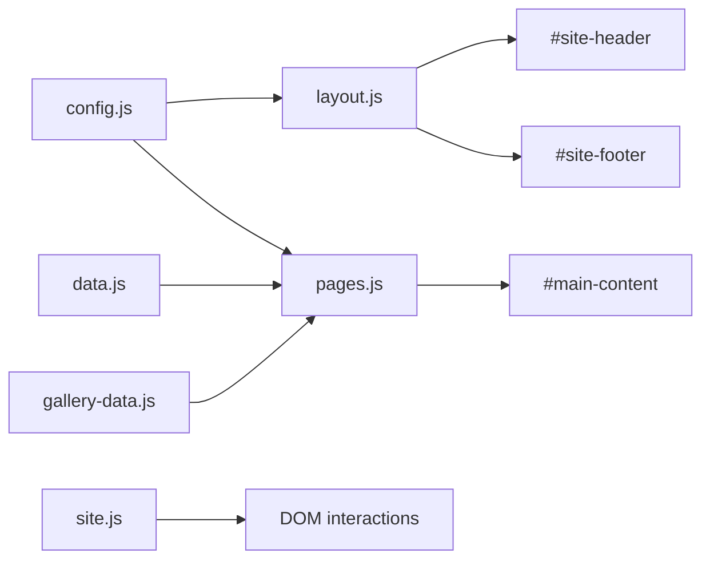
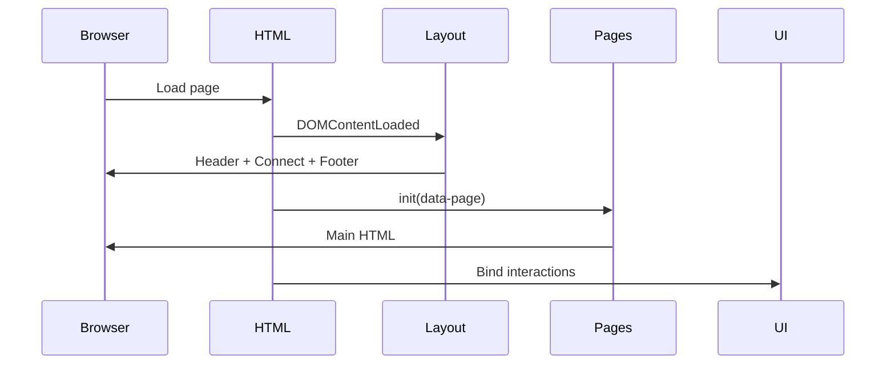

# Architecture

**Version:** 1.2.0

---

## Table of contents

1. [Overview](#overview)
2. [Application structure](#application-structure)
3. [Routing](#routing)
4. [Boot sequence](#boot-sequence)
5. [Module map](#module-map)
6. [Component hierarchy](#component-hierarchy)
7. [Data flow](#data-flow)
8. [Asset organization](#asset-organization)
9. [Navigation flow](#navigation-flow)
10. [Responsive strategy](#responsive-strategy)
11. [Configuration](#configuration)
12. [Diagrams](#diagrams)

---

## Overview

The site is a **static multi-page application**. Each HTML file is a thin shell. Shared chrome and page bodies are injected by JavaScript into `#site-header`, `#main-content`, and `#site-footer`.

Global namespace: `window.VM`.

---

## Application structure

```text
HTML shell (data-page="…")
  ├── config.js      → VM.site, VM.images, VM.version
  ├── data.js        → VM.data + helpers
  ├── gallery-data.js→ VM.galleryImages (home/gallery/speaking)
  ├── layout.js      → header, footer, Connect, CTAs
  ├── pages.js       → page HTML + filters/lightbox
  └── site.js        → theme, nav, reveal, counters, carousel
```

Styling: Tailwind utility classes in templates + `assets/css/executive.css` for brand and complex layouts.

---

## Routing

There is **no client-side router**.

| URL | Mechanism |
|-----|-----------|
| `*.html` | Direct page load |
| `project.html?slug=…` | Query param; `VM.pages.initProjectRedirect()` |
| Hash links (`#about`, `#contact`) | Native scroll + `scroll-padding-top` |
| Apache clean URLs | Optional `.htaccess` rewrites to `.html` |

Invalid project slug → redirect to `projects.html`.

---

## Boot sequence

1. Inline script applies `dark` class from `localStorage` (`vm-theme`) before paint.
2. Tailwind CDN + Lucide + fonts + `executive.css` load.
3. Body scripts run in order (gallery-data only on pages that need it).
4. `layout.js` replaces `#site-header` and fills `#site-footer` (includes Connect).
5. `pages.js` fills `#main-content` based on `document.body.dataset.page`.
6. `site.js` wires theme, nav, reveal, counters, timeline, testimonials, back-to-top.
7. Lucide icons refreshed via `VM.ui.refreshIcons()`.

---

## Module map

| Module | Responsibility |
|--------|----------------|
| `config.js` | Site identity, contact URLs, image path map, version |
| `data.js` | Portfolio content; `getProject`, `featuredProjects` |
| `gallery-data.js` | Gallery catalogue + filters + `galleryFeatured` |
| `layout.js` | Header / drawer / Connect / footer / compact CTAs |
| `pages.js` | Page renderers, project case study, gallery UI, filters |
| `site.js` | Interactions and progressive enhancement |

---

## Component hierarchy

```text
document
├── skip-link
├── #site-header → <header.site-header>
│   └── nav.site-header__nav (desktop links + CV + hamburger)
├── #nav-overlay (sibling of header — not nested)
├── #nav-drawer (mobile panel)
├── #main-content → page sections from VM.pages
└── #site-footer
    ├── #contact.connect-section
    ├── footer.site-footer
    └── #back-to-top
```

Mobile drawer and overlay are **siblings of the header** (not children) so `backdrop-filter` on the scrolled header cannot clip `position: fixed` menu panels.

---

## Data flow



Content updates are made in data modules; renderers read them on each page load (no hydration framework).

---

## Asset organization

| Area | Path | Role |
|------|------|------|
| Brand | `assets/images/vincelogo.png` | Logo |
| Favicons | `assets/images/favicon*` + android chrome | PWA / tabs |
| Web photos | `assets/images/Vince/web/` | Site-facing optimized |
| Gallery sources | `assets/images/Vince/gallery/` | Full gallery sources |
| Thumbs | `assets/images/Vince/gallery/thumbs/` | Lightweight grid thumbs |
| CV | `assets/cv/vicent-manila-cv.pdf` | Download target (file must be present) |

See [IMAGE_ASSETS.md](./IMAGE_ASSETS.md).

---

## Navigation flow

**Primary nav** (`VM.site.nav`): About, Leadership, Experience, Projects, Gallery, Insights, Contact (CTA).

**Footer-only extras:** Speaking (and full link set).

**Mobile:** Full-height drawer below header; closes on link, Escape, backdrop, desktop resize.

---

## Responsive strategy

- Desktop layouts preserved from ~1024px upward.
- Dedicated mobile rules for hero, Connect, project hero, nav, spacing.
- Prefer `clamp()`, CSS Grid / Flex, `aspect-ratio`, `100dvh` for viewports.
- Details: [RESPONSIVE_GUIDE.md](./RESPONSIVE_GUIDE.md).

---

## Configuration

Primary config object: `VM.site` in `assets/js/config.js`.

Also:

- `VM.version` — semantic version string
- `VM.images` — named image shortcuts
- Tailwind `tailwind.config` inline in each HTML head (colours, `maxWidth.8xl`)

---

## Diagrams

### Page request



### Project detail

```text
project.html?slug=leading-aiesec-rwanda
  → VM.getProject(slug)
  → hero + case study + gallery + impact + related
  → initProjectGallery(lightbox)
```
